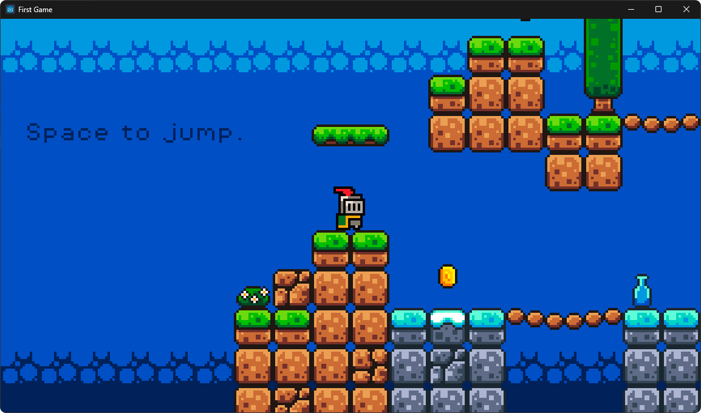

# Knights Quest

Um jogo de plataformas 2D em _pixel art_ desenvolvido no Godot Engine, onde controlas um cavaleiro numa aventura para recolher moedas e evitar perigos.

## 🎮 Funcionalidades

- **Mecânicas de Plataforma:** Movimentação suave com gravidade e saltos calibrados.
- **Animações do Jogador:** Sistema dinâmico que alterna entre animações de "idle" (parado), "run" (correr) e "jump" (saltar) com base na direção e estado do solo.
- **Sistema de Pontuação:** Coleta moedas espalhadas pelo nível, com a pontuação a ser atualizada em tempo real na interface através de um `GameManager`.
- **Estilo Retro:** Configurado com filtro de texturas _nearest-neighbor_ para preservar a nitidez da _pixel art_.
- **Áudio:** Inclui música de fundo e efeitos sonoros para ações como saltar, apanhar moedas e sofrer dano (baseado nos ficheiros de áudio detetados).

## 🕹️ Controlos

Os controlos foram configurados no `Input Map` do projeto para suportar tanto teclado (WASD e Setas) como ações padrão:

| Ação               | Tecla Principal | Tecla Alternativa |
| ------------------ | --------------- | ----------------- |
| **Mover Esquerda** | `A`             | Seta Esquerda     |
| **Mover Direita**  | `D`             | Seta Direita      |
| **Saltar**         | `Espaço`        | Seta Cima         |

## 🛠️ Tecnologias Utilizadas

- **Motor de Jogo:** Godot 4.4
- **Linguagem:** GDScript
- **Renderização:** Forward Plus

## 📂 Estrutura do Projeto

O projeto segue uma estrutura organizada de cenas e scripts:

- `scripts/player.gd`: Gere a física do personagem (velocidade, gravidade) e input do utilizador.
- `scripts/game_manager.gd`: Controla a lógica global, como a contagem de pontos e atualização da UI.
- `scenes/`: Contém as cenas pré-fabricadas como Jogador, Inimigos (Slimes), Moedas e Plataformas.

## 🚀 Como Executar

1. Certifica-te de que tens o **Godot 4.4** instalado.
2. Clona este repositório.
3. Abre o Godot e seleciona `Import`.
4. Navega até à pasta do projeto e seleciona o ficheiro `project.godot`.
5. Pressiona o botão de "Play" ou `F5` para iniciar a cena principal.

---

_Desenvolvido como parte de um projeto de aprendizagem de desenvolvimento de jogos._
